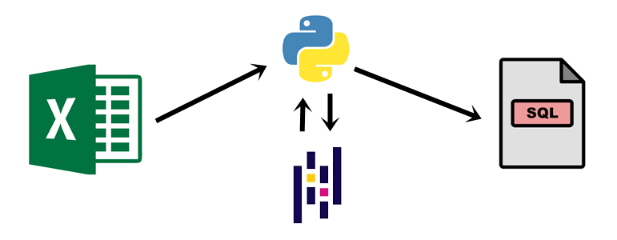

<h1 align="center"> FelipedelosH </h1>
 
<h4>Data VIH excel to SQL</h4>

 
:construction: Status of project :construction:
 
Enter to <a>https://www.datos.gov.co</a> and search information about death from HIV in the link <a>https://www.datos.gov.co/Salud-y-Protecci-n-Social/Mortalidad-VIH-2010-A-2016/yht4-twf4/related_content</a> and get the file. 
Using Pandas + Python create a query to insert the data.

## :hammer:Funtions:

- `Function 1`: Convert data .csv to sql insert (main.py). 
- `Function 2`: insert and print Data (insert_and_view.py). 

## :play_or_pause_button:How to execute a project

- main.py to create SQL query.
- insert_and_view to insert data.

## :hammer_and_wrench:Tech.

- Python
- Pandas
- SQlite3
- SQL

## :warning:Warning.

- in construction.

## Autor

| [ Andrés Felipe Hernánez](https://github.com/felipedelosh)|
| :---: |